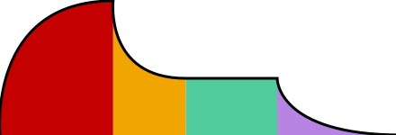
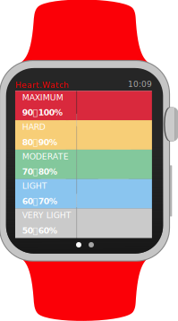
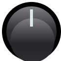
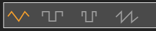

# AudioKit Graphics

This repo is for AudioKit's scalable vector graphical elements for audio apps, applications, playgrounds, and plugins.

Here are some examples included:

## ADSR View

## Heart Watch

## ROM Player Knob

## Synth Segment View

Good links about creating custom controls
-----------------------------------------
* [Ray Wenderlich: How To Make a Custom Control Tutorial: A Reusable Slider](https://www.raywenderlich.com/76433/how-to-make-a-custom-control-swift)
* [Exploring KVO Alternatives with Swift](http://blog.scottlogic.com/2015/02/11/swift-kvo-alternatives.html)
ls
